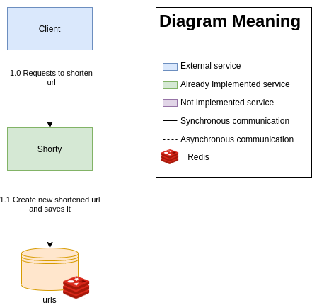

# Shorty

[](https://codecov.io/gh/eaneto/shorty)

A simple URL shortener, built using Java 11 and Postgres.

## Architecture



## Local environment

To run shorty you must first build the project using the gradle
wrapper, then run the docker-compose command to run redis and build
shorty docker image.

```bash
./gradlew clean build
docker-compose up -d
```

if you only want to run redis you run docker compose specifying the
`docker-compose-redis.yml` file.

```bash
docker-compose -f docker-compose-mysql.yml up -d
```

**Note**: the project is configured to build using java 11, if you
need to run in an older version you'll need to adapt some parts of the code.

## Endpoints

### Shorten urlEntity

```
POST /shorten
```

#### Request payload example

```json
{
  "urlEntity": "www.github.com/eaneto/shorty"
}
```

```bash
curl -X POST http://shorty.example/shorten \
    -H 'Content-Type: application/json' \
    -d'{"urlEntity": "www.github.com/eaneto/shorty"}'
```

#### Response payload example

```json
{
  "original_url": "www.github.com/eaneto/shorty",
  "shortened_url": "asd1a9SJs1"
}
```

### Get original urlEntity from shortened

```bash
GET /shorten/{shortenedUrl}
curl http://shorty.example/shorten/asd1a9SJs1
```

### Redirect to original urlEntity

```bash
GET /{shortenedUrl}
curl http://shorty.example/asd1a9SJs1
```
